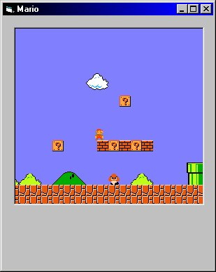



## Super Mario Bros\. 1

### Description

updated-- the physics make more sense and are much more similar to the real mario game. there are still some minor glitches with jumping and they appear to be random or just really hard to figure out. the level editor is worthless, i just made it for my purposes, but you do need the level file in that level editor directory so keep it. "11.txt" keep the comments coming. thanks for checking it out. the game is not really close to complete yet, but it looks pretty cool and works for the most part. have fun
 
### More Info
 

             |
---                |---
**Submitted On**   |2004-06-03 18:16:22
**By**             |[john hollister](https://github.com/Planet-Source-Code/PSCIndex/blob/master/ByAuthor/john-hollister.md)
**Level**          |Intermediate
**User Rating**    |4.8 (86 globes from 18 users)
**Compatibility**  |VB 6\.0
**Category**       |[Games](https://github.com/Planet-Source-Code/PSCIndex/blob/master/ByCategory/games__1-38.md)
**World**          |[Visual Basic](https://github.com/Planet-Source-Code/PSCIndex/blob/master/ByWorld/visual-basic.md)
**Archive File**   |[Super\_Mari175345632004\.zip](https://github.com/Planet-Source-Code/john-hollister-super-mario-bros-1__1-51126/archive/master.zip)

